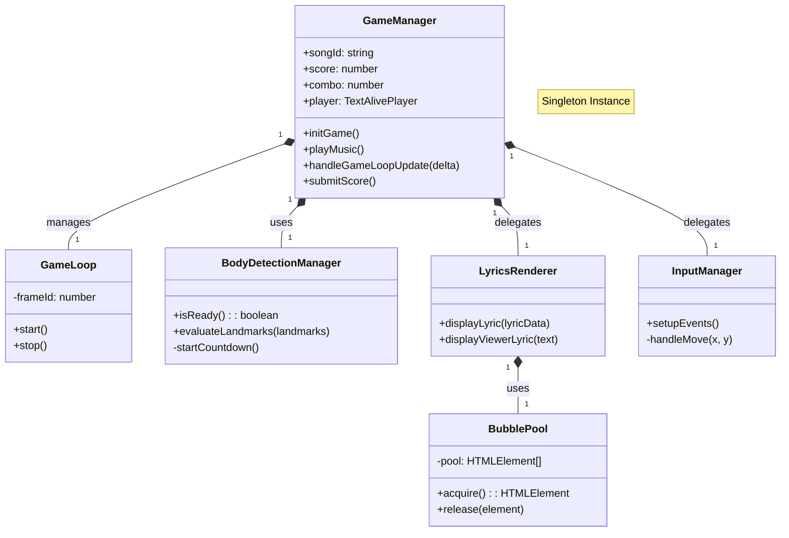

# 🏗️ 2. アーキテクチャ詳細

## 2.1 クラス関係図 (Class Diagram)

システムの中心となる `GameManager` と周辺モジュールの関係性を示します。



---

## 2.2 ディレクトリ構造 (Directory Structure)

主要なソースコードの配置と役割です。

```text
src/
├── 📂 game/                # ゲームコアロジック
│   ├── GameManager.ts       # 🎮 メインコントローラー
│   ├── GameLoop.ts          # ⏱️ ループ管理
│   ├── BubblePool.ts        # ♻️ オブジェクトプール
│   ├── TimerManager.ts      # ⏲️ タイマー管理
│   ├── gameLoader.ts        # 🎵 楽曲設定
│   └── events.ts            # 📢 イベント定義
├── 📂 components/game/     # ゲームUIコンポーネント
│   ├── RankingModal.tsx     # 🏆 ランキング画面
│   ├── RankingPanel.tsx     # 📊 リスト表示
│   └── ModeTabs.tsx         # 📱 モード切替
└── 📂 worker/              # バックエンド (Cloudflare)
    ├── 📂 routes/
    │   └── score.ts         # 📡 スコアAPI
    ├── 📂 middleware/
    │   └── session.ts       # 🔐 セッション管理
    └── rateLimiter.ts       # 🚦 レート制限 (Durable Object)
```