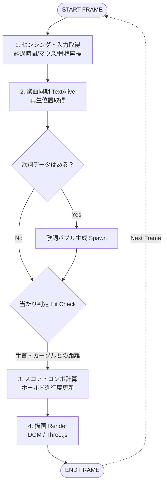
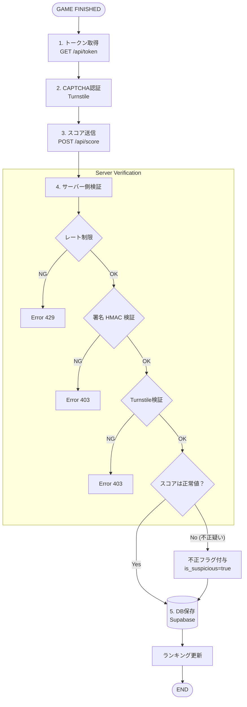

# 🔄 3. 詳細処理フロー図

## 3.1 ゲームループ処理 (Main Loop)
`requestAnimationFrame` によって毎フレーム（約1/60秒ごと）実行される処理の流れです。

---

## 3.2 スコア送信フロー (Score Submission)
ゲーム終了後、クライアントからサーバーへスコアを送信し、検証を経て保存するまでのプロセスです。

### 処理詳細補足
* **ゲームループ**: ユーザー入力（マウス、タッチ、骨格）と楽曲再生位置を毎フレーム同期させ、判定と描画を行います。
* **スコア送信**: 不正なスコア送信を防ぐため、サーバー側で「レート制限」「署名検証」「Bot認証」「スコア妥当性チェック」の4重の検証を行います。
