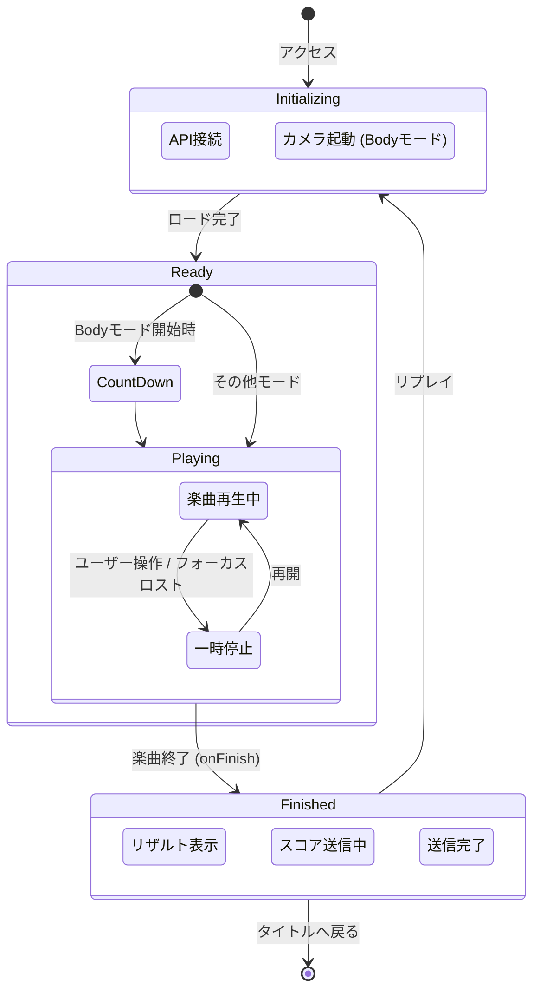

# 📱 4. 画面・状態遷移図

## 4.1 ゲームライフサイクル

ユーザー操作とゲーム内部状態の遷移定義です。

---

## 4.2 ルーティング (URL設計)

| パス | コンポーネント | 説明 |
| :--- | :--- | :--- |
| `/` | `IndexPage.tsx` | **タイトル画面** モード選択、ランキング閲覧、ヘルプ表示が可能。 |
| `/game` | `GamePage.tsx` | **ゲーム画面** クエリパラメータ `?mode=cursor|body|mobile` で挙動を変化させる。 |